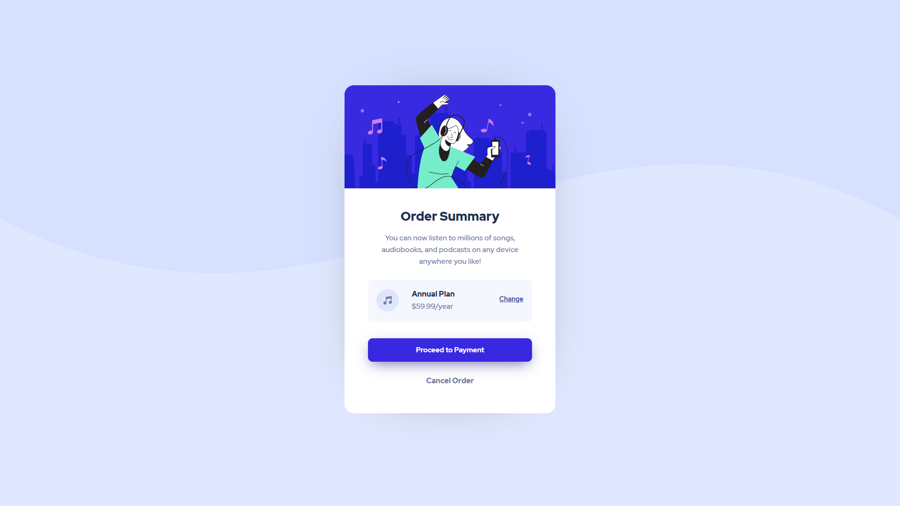

# Frontend Mentor - Order summary card solution

This is a solution to the [Order summary card challenge on Frontend Mentor](https://www.frontendmentor.io/challenges/order-summary-component-QlPmajDUj). Frontend Mentor challenges help you improve your coding skills by building realistic projects. 

## Table of contents

- [Overview](#overview)
  - [The challenge](#the-challenge)
  - [Screenshot](#screenshot)
- [My process](#my-process)
  - [Built with](#built-with)
  - [What I learned](#what-i-learned)
  - [Continued development](#continued-development)
  - [Useful resources](#useful-resources)
- [Author](#author)


## Overview

### The challenge

Users should be able to:

- See hover states for interactive elements

### Screenshot


<p align="center">
  
</p>

## My process

### Built with

- Semantic HTML5 markup
- CSS custom properties
- Flexbox

### What I learned

I learnt how to construct the layout with divs in HTML and flex property in CSS

For any element I used way to center them by flexbox for example:
```html
  <div class="centered-summary">
       <h1>Order Summary</h1>
       <p>You can now listen to millions of songs, audiobooks, and podcasts on any device anywhere you like!</p>
  </div>
```
This CSS lines helped me a lot to center elements and it makes it easier than padding and margin centering way 
```css
.centered-summary {
  display: flex;
  justify-content: center;
  align-items: center;
}
```


### Continued development

In the future I will try different ways to build the layout of the page. I will search more on grid and practice more on using flexbox

### Useful resources

- [Example resource 1](https://www.w3schools.com/cssref/css3_pr_box-shadow.asp) - This helped me to understand the box shadow and have a lot of tries on it.

## Author

- Behance - [Mahmoud Ashraf](https://www.behance.net/m_ashraffarouk/)
- Frontend Mentor - [@m-Ash1](https://www.frontendmentor.io/profile/m-Ash1)
- Twitter - [@m_ashraffarouk](https://www.twitter.com/m_ashraffarouk)


